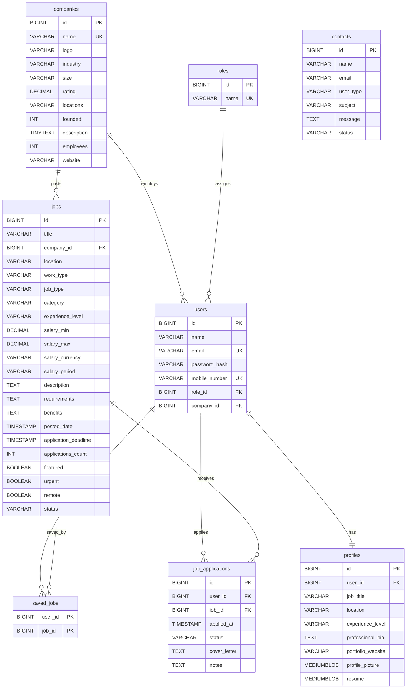

# JobPortalAPI 💼


## About

JobPortalAPI is a production-grade talent acquisition and job board REST API built with Spring Boot 4.0.1 and Java 25. It facilitates modern job search, profile management, resume parsing, and employer listings. The system features stateless JWT authentication with role-based access control, AOP-based input validation, native Spring 7.0/Boot 4.0 media-type API versioning, Caffeine caching for optimized lookups, and a fully integrated OpenTelemetry (OTel) observability stack exporting metrics, logs, and traces to a Grafana LGTM container.

## Features

- **JWT Authentication** — Secure, stateless role-based access control (RBAC) supporting `ROLE_JOB_SEEKER`, `ROLE_EMPLOYER`, and `ROLE_ADMIN`.
- **Spring 7.0 / Boot 4.0 Native API Versioning** — Media-type based API versioning dynamically configured to route traffic seamlessly.
- **AOP Auditing & Validation** — Cross-cutting validation aspects for user registration and compromised password checking using AspectJ.
- **Caffeine Cache Optimization** — Programmatic in-memory caching for jobs, companies, and roles to minimize database latency.
- **Declarative HTTP Clients** — Interacts with external REST APIs using Spring 6's native `@HttpExchange` interfaces and `RestClient`.
- **OTel Observability** — End-to-end telemetry exporting logs, metrics, and traces to Grafana LGTM (Loki, Tempo, Mimir, Grafana) via OTLP.
- **Trace Context-Linked Exceptions** — Global exception handler intercepts errors and injects active OTel `traceId` values into client response payloads.
- **Compromised Password Verification** — Integrates Spring Security's `CompromisedPasswordChecker` with the HaveIBeenPwned API to block leaked credentials.
- **Dockerized Development Environment** — Automatic service orchestration via Spring Boot Docker Compose for MySQL and Grafana LGTM.

## Tech Stack

| Layer | Technology |
|---|---|
| Language | Java 25 |
| Framework | Spring Boot 4.0.1 |
| Security | Spring Security + JWT |
| Database | MySQL |
| ORM | Spring Data JPA + Hibernate |
| Cache | Caffeine Cache |
| Observability | OpenTelemetry + Grafana LGTM (Loki, Tempo, Mimir, Grafana) |
| Documentation | Swagger / OpenAPI (Springdoc-openapi v2.8.14) |
| Dev Tools | Spring Boot Docker Compose + Lombok |
| Build Tool | Maven |

## Database Design

The database consists of 8 core tables with automated JPA Auditing (`BaseEntity` tracking `createdAt`, `createdBy`, `updatedAt`, and `updatedBy`):

- **User** — User accounts with hashed passwords and role assignments.
- **Role** — Standardized RBAC roles (`ROLE_JOB_SEEKER`, `ROLE_EMPLOYER`, `ROLE_ADMIN`).
- **Profile** — Job seeker profiles containing resumes, bios, and profile pictures.
- **Company** — Employer organization details, locations, and industries.
- **Job** — Job listings containing requirements, salaries, types, and deadlines.
- **SavedJob** — Relational mapping of jobs saved by seekers.
- **JobApplication** — Tracking applications, statuses, and cover letters.
- **Contact** — Feedback messages submitted by visitors.



## API Endpoints

### Auth
| Method | Endpoint | Description | Access | Version |
|---|---|---|---|---|
| POST | `/api/auth/register/public` | Register a new user | Public | v1.0 |
| POST | `/api/auth/login/public` | Log in and receive a JWT token | Public | v1.0 |

### Profile & Jobseeker
| Method | Endpoint | Description | Access | Version |
|---|---|---|---|---|
| GET | `/api/users/profile/jobseeker` | Retrieve your seeker profile | JOB_SEEKER | v1.0 |
| PUT | `/api/users/profile/jobseeker` | Create/update profile (multipart: bio, pic, resume) | JOB_SEEKER | v1.0 |
| GET | `/api/users/profile/picture/jobseeker` | Download profile picture | JOB_SEEKER | v1.0 |
| GET | `/api/users/profile/resume/jobseeker` | Download resume PDF | JOB_SEEKER | v1.0 |
| POST | `/api/users/saved-jobs/{jobId}/jobseeker` | Save a job listing | JOB_SEEKER | v1.0 |
| DELETE | `/api/users/saved-jobs/{jobId}/jobseeker` | Unsave a job listing | JOB_SEEKER | v1.0 |
| GET | `/api/users/saved-jobs/jobseeker` | List saved jobs | JOB_SEEKER | v1.0 |
| POST | `/api/users/job-applications/jobseeker` | Submit job application | JOB_SEEKER | v1.0 |
| DELETE | `/api/users/job-applications/{jobId}/jobseeker` | Withdraw application | JOB_SEEKER | v1.0 |
| GET | `/api/users/job-applications/jobseeker` | View my job applications | JOB_SEEKER | v1.0 |

### Jobs & Employers
| Method | Endpoint | Description | Access | Version |
|---|---|---|---|---|
| GET | `/api/jobs/employer` | List jobs posted by employer | EMPLOYER | v1.0 |
| POST | `/api/jobs/employer` | Post a new job listing | EMPLOYER | v1.0 |
| PATCH | `/api/jobs/{jobId}/status/employer` | Update job listing status | EMPLOYER | - |
| GET | `/api/jobs/applications/{jobId}/employer` | View applicants for a job | EMPLOYER | - |
| PATCH | `/api/jobs/applications/employer` | Update application status (Shortlist/Reject) | EMPLOYER | - |

### Public & Companies
| Method | Endpoint | Description | Access | Version |
|---|---|---|---|---|
| GET | `/api/companies/public` | List all companies | Public | v1.0 |
| POST | `/api/contacts/public` | Submit contact form | Public | v1.0 |
| GET | `/api/logging/public` | Test logging endpoints | Public | v1.0 |

### Admin
| Method | Endpoint | Description | Access | Version |
|---|---|---|---|---|
| POST | `/api/companies/admin` | Create a new company | ADMIN | v1.0 |
| GET | `/api/companies/admin` | List all companies (admin view) | ADMIN | v1.0 |
| PUT | `/api/companies/{id}/admin` | Update company details | ADMIN | v1.0 |
| DELETE | `/api/companies/{id}/admin` | Delete company record | ADMIN | v1.0 |
| GET | `/api/contacts/admin` | List contact messages | ADMIN | - |
| GET | `/api/contacts/sort/admin` | List contact messages sorted | ADMIN | - |
| GET | `/api/contacts/page/admin` | Page & sort contact messages | ADMIN | - |
| PATCH | `/api/contacts/{id}/status/admin` | Close contact message | ADMIN | - |
| GET | `/api/users/search/admin` | Find user by email | ADMIN | - |
| PATCH | `/api/users/{userId}/role/employer/admin` | Elevate user to EMPLOYER | ADMIN | - |
| PATCH | `/api/users/{userId}/company/{companyId}/admin` | Assign company to Employer | ADMIN | - |

## Getting Started

### Prerequisites
- **Java 25**
- **Docker Desktop**
- **Maven** (or the included Wrapper `./mvnw`)

### Run Locally

1. **Clone the repository**
   ```bash
   git clone https://github.com/yourusername/jobportal.git
   cd jobportal
   ```

2. **Run with Spring Boot Docker Compose**
   The application uses the `spring-boot-docker-compose` module. As soon as you start the application, Spring Boot automatically spins up MySQL and the OTel Grafana LGTM stack using the local `compose.yml`. Make sure Docker Desktop is running.

   ```bash
   ./mvnw spring-boot:run
   ```

3. **Access Grafana Dashboard**
   Telemetry data is exported automatically. Access Grafana at:
   - **URL:** [http://localhost:3000](http://localhost:3000)

4. **Access Swagger UI**
   Explore the API endpoints directly:
   - **URL:** [http://localhost:8080/swagger-ui/index.html](http://localhost:8080/swagger-ui/index.html)

## Key Technical Decisions

**Why Media-Type versioning for APIs?**
Traditional path-based (`/v1/jobs`) or query-parameter versioning pollutes the URL space. Using Spring Boot 4.0's native `ApiVersionConfigurer` with custom media types (e.g., `application/vnd.eazyapp+json;v=1.0`) honors the principle of content negotiation, keeps resource URIs clean, and enables elegant negotiation of API contract transitions.

**Why Compromised Password checks?**
Weak passwords are the leading cause of security breaches. Instead of using complex regex patterns that worsen developer and user experience, we integrated the native Spring Security `CompromisedPasswordChecker` targeting the public **HaveIBeenPwned API** via k-Anonymity. Any password that has been leaked in past breaches is blocked at registration.

**Why Profile-based Auth Bypass in Dev?**
In high-velocity development and test cycles, generating JWTs for every manual integration check slows progress. By introducing `JobPortalNonProdUsernamePwdAuthenticationProvider` when the `prod` profile is inactive, we bypass active password validation—allowing any email that exists in the database to authenticate successfully with a dummy password.

**Why Trace IDs in API Exception Payloads?**
Debugging failures in microservices or production-grade monoliths requires jumping from the client error to server logs. The global exception handler extracts the current request's trace ID via Micrometer's `Tracer` and returns it within the JSON response payload. Developers can search this exact trace ID in Grafana to view execution paths, query timings, and OTel log appender traces.

**Why AOP for Registration Validation?**
Registration requires checking email/phone uniqueness and querying HaveIBeenPwned. Putting this validation inside controllers or service boundaries violates the Single Responsibility Principle. Using AspectJ (`@Before` advices) modularizes validation checks, keeping controller mapping cleaner and cleaner to test.

## Author

Your Name  
LinkedIn: [linkedin.com/in/yourprofile](https://linkedin.com/in/yourprofile)  
GitHub: [github.com/yourusername](https://github.com/yourusername)
